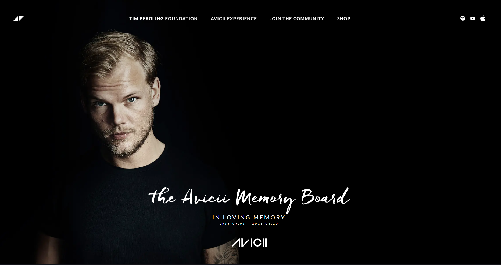

# Avicii

This is a personal project, which I am using to learn and train what I know in Svelte.  
Miss you Tim❤️

## Clone

Git  
``
git clone https://github.com/leonardotavares20/AviciiSvelte.git
``

GH(GitHub CLI)  
``
gh repo clone leonardotavares20/AviciiSvelte
``

## Install
``
pnpm install
``

## Run
``
pnpm dev
``

## Open

``
http://localhost:5173
``
